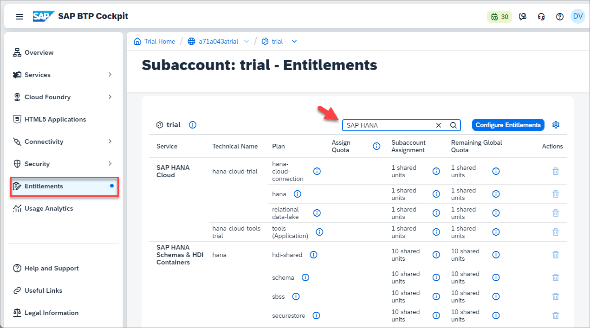
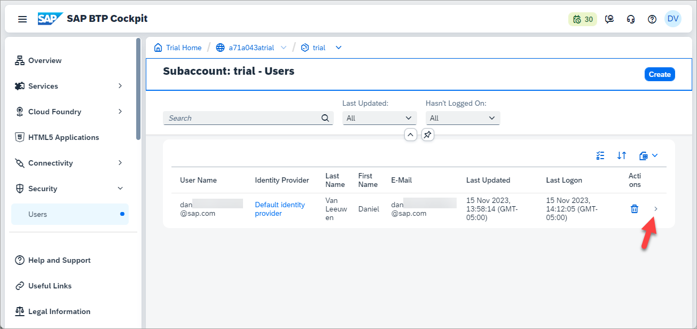
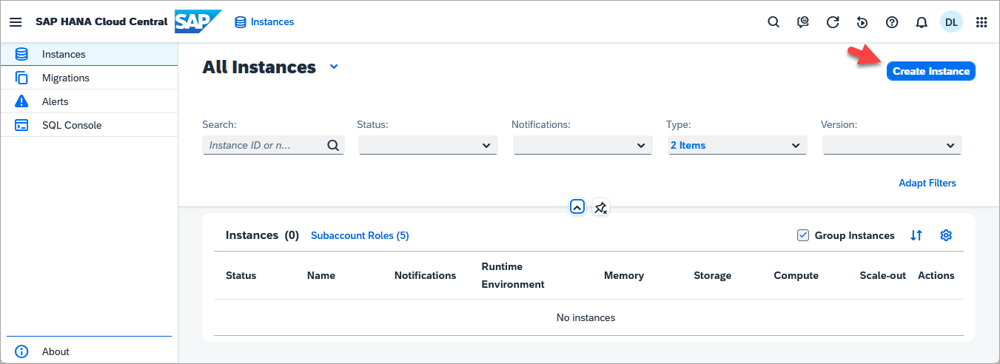
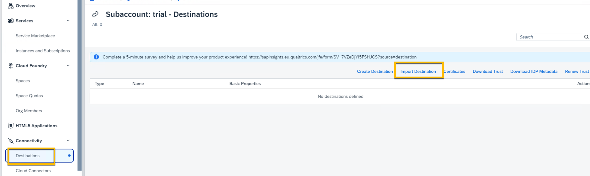
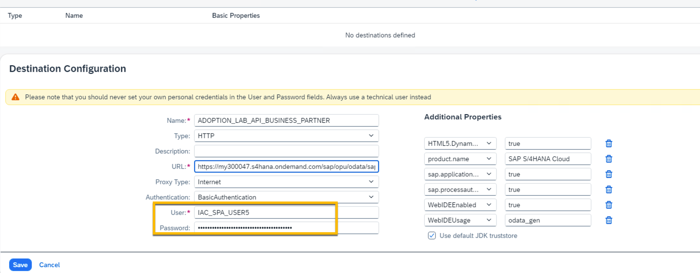

# Getting Started - Preparation

---

Let's start the exercise and check if everything is ready to go.
Please make sure you have completed all the necessary prerequisites listed below. If not, please raise your voice so that we can assist you early in the session.

# Setup SAP Build Code in SAP BTP
<!-- description --> SAP Build Code provides generative AI-based code development with Joule copilot, optimized for Java and JavaScript application development. It offers a turn-key environment for coding, testing, integrations, and application lifecycle management.

Perform these preparatory steps to set up your system for creating your business applications in SAP Build Code.

### Run the SAP Build Code Booster

>**Note** This tutorial assumes that you are using an SAP BTP Trial account. If you are using a different account, some steps might be different.

1. Access your **BTP global account**.

2. In the navigation pane, click **Boosters**. 

    
3. Search for **SAP Build Code**.
   

    >There is a booster for each of the SAP Build Code service plans. Make sure to select the one relevant to the plan you want to work in.
    
4. Open the booster to see the overview, components, and additional resources, and click **Start**.

   

    The booster checks for required authorizations, compatible providers, and regions, as prerequisites for successful execution.

5. After running the booster, in the popup window, click **Navigate to Subaccount**.
    

### Verify Subscription
1. From the navigation pane, select **Services** > **Instances and Subscriptions**.
   

2. Make sure you are subscribed to SAP Business Application Studio and to SAP Build Code. 

3. Click **SAP Build Code**.

    The SAP Build lobby opens.

---

# Start Using SAP HANA Cloud Trial in SAP BTP Cockpit

In this part, you will learn how to add the new multi-environment tooling SAP HANA Cloud to new or existing trial accounts of SAP Business Technology Platform. Having access to SAP HANA Cloud is a prerequisite for all other tutorials in this mission.

#### Examine entitlements for SAP HANA Cloud

1. In the SAP BTP Cockpit, click on your subaccount.

2. Then click on **Entitlements** on the left-hand side menu and search for entitlements for SAP HANA.

3. Notice that the following entitlements are shown.

* SAP HANA Cloud: `tools (Application)`, `hana`, `hana-cloud-connection`, and `relational-data-lake`

* SAP HANA Schemas & HDI Containers: `hdi-shared`, `schema`, and `securestore`

#### Add a subscription to SAP HANA Cloud tools

1. From SAP BTP Cockpit, click on Services and then Service Marketplace. Search for SAP HANA Cloud and click Create in the top-right corner.

2. Select **SAP HANA Cloud** under Service and **tools** under Plan.

3. To ensure that your desired user has the necessary permissions to manage instances in HANA Cloud Central, navigate to **Security** > **Users** in the left-hand side menu. Then click on your user.

Click on the **Assign Role Collection** button.

Select **SAP HANA Cloud Administrator** then click Assign Role Collection.

4. Navigate to **Instances**, **Instances and Subscriptions** and click on **SAP HANA Cloud** to open SAP HANA Cloud Central.

5. On the top-right corner of the screen, click on **Create Instance**.

6. Here you must choose the **Type** of instance to create. Select **SAP HANA Cloud, SAP HANA Database**.

7. Click on Next Step to continue.

8. If you have multiple types of service plans enabled in your SAP HANA Cloud entitlement, a **License** section will appear just before the Basics section. To use the free tier model, click on **Free Tier** so that it is highlighted as shown below. Note that if you have enabled only one type of service plan in your SAP HANA Cloud entitlement (e.g. free tier only), the License section does not appear and that service plan type will be used automatically.

9. In the **Basics** section, enter a name for your instance in the field **Instance Name**, such as `HC_HDB`.

> This field does not allow any spaces in the name. Keep in mind that you will not be able to change the name after the instance has been created.

10. Insert a password in the **Administrator Password** field.

11. Confirm it by typing it again in the **Confirm Administrator Password** field.

> This password is the admin password for this instance, so make sure to use a strong password. If needed, the password can be reset via the actions menu **Reset DBADMIN Password** in SAP HANA Cloud Central if your user has the role SAP HANA Cloud Security Administrator.

12. Now click on Next Step to continue.

> For a trial instance, the size allocation is predefined to 16 GB for memory, 80 GB for storage and 1 vCPU for computation.

13. Click on **Next Step** to continue.

Here, you can select in this step if you want to create replicas of your instance to increase your system availability. These replicas are exact duplicates of your instance that will be managed in the background and automatically synchronized. In case of issues, you can take over a replica of your instance to ensure minimal interruption.

In a free tier model or trial environment, availability zone and replicas are not supported.

14. Now you can configure the **Advanced Settings**.

* The Data Provisioning Server is not required in this tutorial mission.

* You may manage the allowed connections for your SAP HANA database instance, i.e. allowing access to your SAP HANA database instance from outside of the SAP Business Technology Platform (SAP BTP). Selecting Allow only BTP IP addresses denies all IP addresses outside SAP BTP. You may choose to allow access to specific applications by inserting one or more specific IP addresses or you can allow connections from all IP addresses.

* Next, you can also choose to enable the SAP Cloud Connector, which makes it easier to connect this SAP HANA database instance to an SAP HANA on-premises database. You can also set the connection preferences for your cloud connector under **Allowed connections**.

Click on **Next Step** in the bottom left corner to continue.

15.  Clicking on **Review and Create** in the bottom-right corner

16. Congratulations, you have added the SAP HANA Cloud entitlements and subscribed to the multi-environment tools. You now have the ability to provision your trial instance of SAP HANA Cloud and start your journey.

---

# Set Up SAP Build Work Zone, standard edition

## Subscribe to the services

Before you can access and use the SAP Build Work Zone, standard edition services, you first need to subscribe to them.

1. Click **Services** in the left navigation panel and choose **Instances and Subscriptions**.

Here we can see all of the service instances and subscriptions that have been created for the subaccount. Currently there are none. 
Let's change that. 

2. Click on the **Create** button on the top right hand side of the UI. 

    
3. In the popover that appears use the dropdown available for the "Service" field and choose **SAP Build Work Zone, standard edition** (1). In the plan field select **standard** (2). This allows us to create and configure sites for centralised access to our applications. 
Hit the create button (3). 

   

> ℹ️ Note: The instance type for plan **standard** will be required if you wish to use APIs to integrate with other services such as Cloud Transport Management Service for example, but don't worry about this for now.

Once the creation process has finished successfully, you will see the new subscription in the cockpit. 

All SAP BTP services come with role collections, including administrative permissions which must be assigned to our users. In the case of SAP Build Work Zone we will need to assigned to the `Launchpad_Admin` role. In this step, you'll assign yourself to this role so that you can access the service and carry out administrative tasks.

4. Select **Security > Role Collections** from the side menu.

    
Here we can either use the search field and start typing Launchpad to find the `Launchpad_Admin` role collection or we can simply select it from the list. 
    

    
 Click on the line item (or the arrow at the end of the line item) to expand the role collection details pane.

Here we see more detail about the role collection: the roles that the collection includes, the users who have been assigned to the role collection and any user groups and attribute mappings that have been created foe this role collection.
Click the **Edit** button at the top of the panel (see image above). 

5. Here you are playing the role of the subaccount administrator. Under the **Users** tab, enter your email in both the **ID** and the **E-Mail** fields. In the **Identity Provider** dropdown choose the IAS tenant where trust has been established for the subaccount. In our case it is **Default identity provider**. Then click the **Save** button at the top of the screen.

 We have now assigned the `Launchpad_Admin` role collection to our workshop user and you can access SAP Build Work Zone, standard edition and carry out all your admin tasks.
 Let's access the application.

6. From the side panel, click Services and then **Instances and Subscriptions**.
Under the **Subscriptions** tab we can see the subscription to SAP Build Work Zone standard edition that we created earlier. We can now either click the available link **SAP Build Work Zone, standard edition** or if we enter the details view, we can also click **Go to Application** button on the right.

7. The service opens with the Site Directory in focus. This is where you'll create and manage your sites.

> ℹ️ Note: It may take a few minutes for the admin role assignment to take effect.  If you get an **Access Denied** error, please try to access the admin environment in an anonymous window or logout and login again.

🎉 **Congrats** - you have finished this exercise! You have now created a subscription to SAP Build Work Zone, standard edition, assigned yourself the administrator role and are now ready to create your first site. 

---

## Import the S/4HANA Cloud integration destination

> Download a sample destination for S/4HANA Cloud [ADOPTION_LAB_API_BUSINESS_PARTNER](https://robin-qiu.github.io/BTP-CAP-Development-with-SAP-Build-Code---Bring-Your-Own-Tenant/vx_attachments/477573873607615/ADOPTION_LAB_API_BUSINESS_PARTNER ':include')  :truck::truck::truck:.

2. Import the destination into your BTP subaccount.

3. The credential will be supplied during the adoption lab hands-on session.

