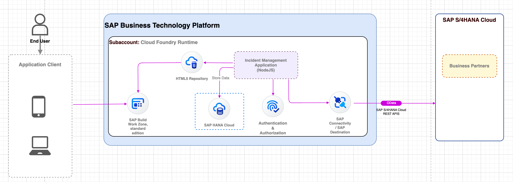

# Speed Up Clean Core Extension with BTP Build Code

---

## Description

ThiThe purpose of the workshop is to provide a comprehensive learning experience tailored to empower participants with the practical skills and knowledge needed for effective utilization of SAP Cloud Application Programming (CAP).

During the workshop, we will let you try out the hands-on on various development features to gain practical experience and will discuss about the CAP CDS, Authorization, HANA Cloud, Fiori Elements and extending S/4HANA Cloud.

You will work through a set of exercises that highlight the capabilities of SAP Build Code with Joule AI copilot. Using SAP Build Code and the Joule AI copilot, you will create data entities and backend logic. 

This workshop is tailored for application developers, offering the opportunity to enhance their extension development capabilities and contribute to enhance solutions within their organizations.

## Overview

### Exercise Overview
In this session, you will learn how to use SAP Build Code with SAP Business Application Studio to develop apps rapidly on the SAP Business Technology Platform (SAP BTP). You will learn how to build a full-blown CRUD application, including backend services and a UI application in a matter of minutes, using only visual editors. You will connect the application to an SAP S/4HANA API. You will learn how to easily switch to code, and continue working from there to create additional business logic for your service to finally make the application available on BTP with a "one-click deployment".

### Use Case

In this adoption lab, we will create an application for Incident Management. To achieve this, we will create a new backend service using the Cloud Application Programming Model (CAP), and a web application based on Fiori elements with which users can manage incidents.

